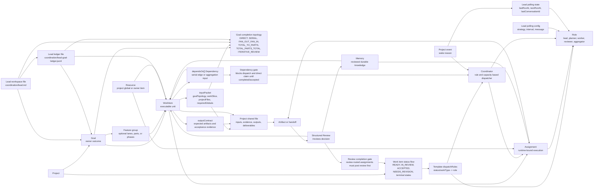

# Goal Completion Topologies And Aggregation

> Status: Draft design
> Scope: shared project workflow contract for goals whose completion may be direct, serial, fan-out/fan-in, or iterative.

## Problem

The current project loop already has the right primitives:

- `Goal` captures the owner outcome.
- `Planner` can split the goal into work items.
- `Lead` reviews whether accepted items are enough to finish the goal.
- `Coordinator` dispatches ready items by role and capacity.
- `Memory`, shared files, and resource requests preserve cross-item context.

The missing contract is topology, not a specific deliverable type. Some goals can be completed by one item, some need a serial chain, some need several workers to collect partial outputs before an aggregation step, and some need review/revision loops. If the roles do not share this completion-topology contract, agents tend to either synthesize too early, create unnecessary work, or mark a goal done merely because no open item is visible.

## Goal Completion Topologies

Lead owns the topology decision for each active goal. Planner assists when decomposition is non-trivial. Coordinator only dispatches work items; it does not decide that a goal is complete.

Common topologies:

1. `DIRECT`: one bounded item can satisfy the goal. Lead creates the item, waits for review/acceptance, verifies the output, and closes the goal.
2. `SERIAL`: the next item depends on the previous accepted output. Lead creates only the next executable step, avoiding speculative downstream work.
3. `FAN_OUT_FAN_IN`: independent collection or production lanes run in parallel, then a later aggregation item combines accepted upstream outputs.
4. `TOTAL_TO_PARTS`: lead or planner creates a brief total plan, then bounded part items. The goal may be done after all parts are accepted if no aggregation deliverable is required.
5. `TOTAL_PARTS_TOTAL`: lead or planner creates a total plan, part items, then a final aggregation/synthesis/delivery item.
6. `ITERATIVE_REVIEW`: a worker item cycles through review and bounded revision until accepted, rejected, or superseded.

The key distinction is whether the goal acceptance bar requires an aggregation deliverable. A combined recommendation, release package, or final decision memo may require one; a batch of independent fixes may not. Lead must inspect the accepted work, dependencies, output contracts, and goal acceptance bar before deciding.

## Target Pattern

For every active goal, the lead polling pass runs a bounded frontier review:

1. Load enough summary state to classify the goal topology and detect lead attention.
2. Skip unchanged goals only when no attention item exists.
3. If resources or owner decisions are missing, create owner-owned resource/action items.
4. If existing items are insufficient, create the smallest missing worker, reviewer, planner, resource, clarification, or revision item.
5. If accepted upstream outputs are sufficient but the goal needs a combined deliverable, create one aggregation item that depends on accepted upstream items.
6. If the goal does not need aggregation and accepted items satisfy the acceptance bar, mark the goal `DONE`.
7. If the aggregation output is accepted and satisfies the acceptance bar, mark the goal `DONE`.

## Flowchart

```mermaid
flowchart TD
  pollTimer["Lead polling config\nIDLE_ONLY or fixed interval"]
  projectEvent["Project events\nitem accepted, resource completed, review resolved, assignment failed"]
  wake["wakeLeadPolling\ncoalesced and skipped if lead is busy"]
  pollRun["Lead polling conversation\nfresh frontier review"]
  leadWorkspace["Lead workspace\ncoordination/lead.md cursor and next queue"]
  ledger["Lead ledger\nstatusDigest, topology, last decision"]
  owner["Owner defines or updates Goal"]
  goal["Goal\nOutcome, acceptance bar, optional final artifact"]
  summaryRead["Bounded summary reads\ngoals, linked item summaries, assignments, events"]
  attentionGate{"Digest unchanged and no lead attention item?"}
  detailRead["Targeted detail reads\nonly attention items, candidate DONE, deps, reviews, files"]
  topologyGate{"Which completion topology fits?\nDIRECT / SERIAL / FAN_OUT_FAN_IN\nTOTAL_TO_PARTS / TOTAL_PARTS_TOTAL / ITERATIVE_REVIEW"}
  resourceGate{"Required resources and owner decisions present?"}
  resourceItem["Owner-owned resource/action item\ninputPacket.resourceRequest or ownerAction"]
  currentEnough{"Accepted upstream outputs\nalready satisfy goal?"}
  aggregationNeeded{"Goal requires combined deliverable?"}
  plannerNeed{"Need decomposition plan?"}
  plannerItem["Planning work item\nworkType PLANNING\nno execution side effects"]
  dependencyGate{"Dependency gate\nall dependsOn items completed/accepted?"}
  dependencyBlocked["Hold item\nlog DEPENDENCIES_UNMET\nno assignment or claim"]
  coordinator["Coordinator dispatches eligible items\nstatus/workType rules, role caps, runtime fit"]
  roleRoute{"Role route\nfrom template dispatchRules"}
  planner["Planner proposes topology\nlanes, dependsOn, output contracts,\naggregation contract"]
  topologyProposal["Topology proposal artifact\nplan plus candidate item set"]
  leadPlan["Lead validates topology\ncreates only missing items"]
  createWork["Create direct/serial work item\nREADY or NEEDS_REVISION\nsmallest executable unit"]
  createParts["Create parallel part items\nREADY with output contracts"]
  aggregationItem["Aggregation/synthesis/delivery item\nworkType AGGREGATION/SYNTHESIS/REPORT/DELIVERY/DECISION_PACKAGE\ndependsOn accepted upstream items"]
  workers["Worker executes bounded item\none slice, step, or revision"]
  aggregator["Aggregator Agent executes\nreads accepted upstream files/items\npreserves links and caveats"]
  files["Shared project files\ninputs, evidence, outputs, deliverables"]
  aggregateOutput["Combined deliverable\nreport, release package, recommendation,\nor decision memo"]
  handoff["Handoff/artifact\nfile paths, verification, blockers,\nmemoryCandidates"]
  reviewQueue["Assignment complete -> IN_REVIEW\nreview-routed by template"]
  reviewer["Review Agent checks artifact\nagainst outputContract and acceptanceCriteria"]
  structuredReview{"Structured review exists?\nPOST /reviews with assignmentId"}
  completionBlocked["Reject runtime completion\nuntil structured review decision exists"]
  reviewDecision{"Review decision\nAPPROVED / CHANGES_REQUESTED / REJECTED"}
  acceptedItem["Item status ACCEPTED\nvia reviewApprovedStatus"]
  revise["NEEDS_REVISION item or bounded follow-up"]
  rejected["REJECTED/CANCELLED\nor superseded by Lead"]
  fanIn{"Fan-in gate\naccepted parts enough?"}
  done["Lead marks Goal DONE\ncompletion summary links support artifacts"]
  ownerView["Owner sees outputs\nProject shared files and item artifacts\nreports/ or deliverables/ paths"]
  missing["Lead creates missing item\nwork, review, resource, clarification"]
  memory["Shared Memory\nreviewed durable facts, decisions, constraints, risks"]

  pollTimer --> wake
  projectEvent --> wake
  wake --> pollRun
  owner --> goal
  pollRun --> leadWorkspace --> summaryRead --> ledger --> attentionGate
  goal --> summaryRead
  attentionGate -- yes --> pollTimer
  attentionGate -- no --> detailRead --> topologyGate
  topologyGate --> resourceGate
  resourceGate -- no --> resourceItem --> pollTimer
  resourceGate -- yes --> currentEnough
  currentEnough -- yes --> aggregationNeeded
  currentEnough -- no --> plannerNeed
  plannerNeed -- yes --> plannerItem --> dependencyGate
  plannerNeed -- no --> leadPlan
  dependencyGate -- no --> dependencyBlocked --> projectEvent
  dependencyGate -- yes --> coordinator --> roleRoute
  roleRoute -- "PLANNING" --> planner --> topologyProposal --> files --> handoff
  roleRoute -- "RESEARCH / ANALYSIS / EXECUTION / DRAFT / GENERAL_TASK" --> workers --> files --> handoff
  roleRoute -- "AGGREGATION / SYNTHESIS / REPORT / DELIVERY / DECISION_PACKAGE" --> aggregator --> aggregateOutput --> files --> handoff
  handoff --> reviewQueue --> reviewer --> structuredReview
  structuredReview -- no --> completionBlocked --> reviewer
  structuredReview -- yes --> reviewDecision
  handoff -. reusable candidates .-> memory
  reviewDecision -. approved candidates .-> memory
  reviewDecision -- CHANGES_REQUESTED --> revise --> dependencyGate
  reviewDecision -- REJECTED --> rejected --> projectEvent
  reviewDecision -- APPROVED --> acceptedItem --> projectEvent
  acceptedItem -- "planning accepted" --> leadPlan
  acceptedItem -- "part/work accepted" --> fanIn
  acceptedItem -- "aggregation accepted" --> done
  leadPlan -- "DIRECT gap or SERIAL next step" --> createWork --> dependencyGate
  leadPlan -- "PARTS needed" --> createParts --> dependencyGate
  leadPlan -- "accepted upstream needs synthesis" --> aggregationItem --> dependencyGate
  fanIn -- "missing part/review/resource" --> missing --> pollTimer
  fanIn -- enough --> aggregationNeeded
  aggregationNeeded -- no --> done
  aggregationNeeded -- yes --> aggregationItem
  done --> ownerView
```



## Object Relationship Map



## Lead Polling Mechanism

Lead polling is the control loop that turns a static plan into a self-healing project pipeline.

Runtime behavior:

- The lead role has a `polling` config with `enabled`, `strategy`, `intervalMinutes`, and a polling `message`.
- `IDLE_ONLY` means the host only starts a polling conversation when the lead runtime is reachable and not already working. If the lead is busy, stopped, or unreachable, the host records `pollingState.nextRunAt` and retries later instead of interrupting the active turn.
- Important state changes can call `wakeLeadPolling`, for example resource completion, review resolution, assignment failure, or other events that may change the goal frontier. These wakes are coalesced with a short timer and deduplicated when polling was recently triggered.
- A polling tick creates a new lead conversation with the polling message. The lead must treat it as a fresh pass.
- The lead should not dispatch workers directly when the coordinator is enabled. It should create or refine READY/NEEDS_REVISION items and let the coordinator run role matching and capacity checks.
- The lead should read `coordination/lead.md` at the start of a polling run and update it before stopping with the cursor, next-goal queue, skipped reasons, unresolved blockers, and project-level decisions.
- The lead should write a compact ledger entry after each inspected goal so later polling runs can skip unchanged goals safely.

Read enough, but not everything:

1. Start from `runtime.resume`, inbox, active assignments, `boardSnapshot`, and the event cursor.
2. Read `coordination/lead.md` if present, then `coordination/lead-goal-ledger.jsonl`.
3. Page active goals with `GET /v1/projects/{projectId}/goals?statuses=IN_PROGRESS,BLOCKED&includeClosed=false&limit=100`.
4. For each active goal under consideration, read linked lead-attention work item summaries with `GET /v1/projects/{projectId}/work-items?goalId=<goalId>&statuses=READY,NEEDS_REVISION,IN_REVIEW,ASSIGNED,IN_PROGRESS,REPORT_READY,REJECTED&limit=100&page=1`; read `statuses=ACCEPTED` only when sufficiency, dependency, or aggregation checks require it.
5. Read assignment/runtime health with the host runtime-state helper so stale or failed assignments are visible before creating duplicates.
6. Read exact work-item detail only for items that may change the decision: pending review, NEEDS_REVISION, owner resource/action, failed/stale assignment, dependency input, aggregation candidate, or candidate goal completion.
7. Read project shared files only for paths named by accepted upstream outputs, output contracts, handoffs, or the candidate final/aggregation artifact.
8. Search memory only for durable decisions, constraints, facts, risks, or open questions that affect this goal's acceptance bar.

Recommended lead ledger record:

```json
{
  "pollingRunId": "2026-06-11T06:40:00.000Z-lead",
  "timestamp": "2026-06-11T06:40:12.000Z",
  "goalId": "goal-123",
  "topology": "FAN_OUT_FAN_IN",
  "statusDigest": "goal/status/items/assignments digest",
  "decision": "aggregation-ready",
  "nextAction": "created DECISION_SYNTHESIS item",
  "createdWorkItemIds": ["work-456"]
}
```

Polling decision loop:

1. Compute the current status digest from goal status, goal `updatedAt`, linked work item ids/statuses/workTypes, dependency edges, review state, resource item state, and open assignment statuses.
2. If the digest is unchanged and there is no READY, NEEDS_REVISION, IN_REVIEW, owner resource, owner action, failed assignment, stale assignment, or blocked dependency needing lead attention, skip the goal.
3. Classify the goal topology from acceptance criteria, existing items, dependencies, output contracts, handoffs, and accepted artifacts.
4. If resources are missing, create or surface owner-owned resource items and mark the goal `BLOCKED` when no execution can proceed.
5. If the current item set is insufficient, create the smallest missing planning, worker, review, revision, resource, or clarification item.
6. If accepted upstream outputs are sufficient and no aggregation deliverable is required, mark the goal `DONE`.
7. If accepted upstream outputs are sufficient and aggregation is required, create the aggregation item.
8. If the aggregation item is accepted and the completion rule is satisfied, mark the goal `DONE`.
9. Append the ledger entry for this goal before moving to the next one.
10. Before stopping, update `coordination/lead.md` with `lastRunId`, `nextGoalCursor`, `unfinishedScanReason`, skipped reasons, next-goal queue, unresolved blockers, and project-level decisions.

## Work Item Contracts

Aggregation-aware items should carry enough structure for the coordinator and workers to operate without hidden chat context.

Recommended `inputPacket` fields:

```json
{
  "goalTopology": {
    "mode": "FAN_OUT_FAN_IN",
    "runId": "<cycle-or-milestone-id>",
    "needsAggregation": true,
    "aggregationArtifactPaths": ["deliverables/<goal-id>/final-summary.md"],
    "acceptanceBar": "Owner-facing deliverable with sources, caveats, and explicit decisions."
  },
  "workSlice": {
    "lane": "source-research",
    "scope": "Collect bounded evidence for one part of the goal and name blockers."
  },
  "projectFiles": [
    { "path": "inputs/<goal-id>/brief.md", "source": "owner" }
  ],
  "requiredGlobals": ["<required_resource_key>"]
}
```

Backward compatibility: existing domain templates may still carry older domain-specific input aliases. Treat them as compatibility shims and normalize new work to `goalTopology` and `workSlice`.

Recommended `outputContract` fields:

```json
{
  "type": "aggregation-input",
  "description": "A bounded upstream artifact for one goal lane.",
  "expectedArtifacts": ["work/<goal-id>/source-research.md"],
  "sharedFiles": ["work/<goal-id>/source-research.md"],
  "mustInclude": [
    "source paths read",
    "freshness or staleness notes",
    "findings supported by evidence",
    "blockers and missing data"
  ]
}
```

Aggregation items should list every accepted upstream artifact in `inputPacket.projectFiles` and depend on the accepted upstream work items.

## Role Responsibilities

- `LEAD_AGENT`: owns the goal frontier, topology classification, resource gate, fan-in gate, gap creation, aggregation decision, and final `DONE` decision. It should not close a goal until accepted items or accepted aggregation outputs satisfy the goal acceptance bar and no linked non-terminal work remains.
- `PLANNER_AGENT`: proposes the goal topology, lanes, dependencies, and output paths when decomposition is non-trivial. It should prefer small independent slices and use feature groups only when lanes, parts, or phases are independently reviewable.
- `COORDINATOR`: dispatches READY/NEEDS_REVISION items according to template rules, role caps, missing resource checks, and active assignment state. It should not decide that the goal is complete.
- `WORKER_AGENT`: executes exactly one assigned slice, step, or revision; writes promised shared files; verifies those files exist; and submits a handoff. It should stop on missing required globals and name the exact key.
- `REVIEW_AGENT`: verifies each item or aggregation artifact against its contract. On approval, only durable `memoryCandidates` become memory.
- `AGGREGATOR` role: reads accepted upstream items/files, preserves source links and caveats, writes the combined deliverable, and does not invent unsupported claims.
- `OWNER`: supplies resource items, clarifies scope, and approves human gates.

## Memory And Resource Rules

- Use `Memory` for durable reusable facts, decisions, constraints, risks, and open questions. Do not use it as the progress log for assembly.
- Use shared project files for evidence, source notes, intermediate analysis, outputs, and final deliverables.
- Use owner-owned resource work items for credentials, accounts, approvals, preferences, paid data access, or missing input files.
- Downstream items should depend on resource items or list `requiredGlobals`; the coordinator should hold them until resources are configured.
- Workers may propose memory in handoff metadata, but reviewers decide what becomes durable memory.

## Skill Contract

1. Add a shared "Goal Completion Topologies" section to `agent-workspace-lead`:
   - classify direct, serial, fan-out/fan-in, total-parts, total-parts-total, and iterative review goals,
   - treat fresh conversations and polling ticks as frontier-review passes,
   - maintain the lead ledger and skip unchanged goals safely,
   - run the resource gate,
   - decide whether current items are sufficient,
   - create aggregation only when accepted upstream work is enough and the goal requires aggregation.
2. Add the same pattern to `agent-workspace-planner`:
   - propose topology, `workSlice`, `outputProjectFiles`, dependencies, and aggregation contract,
   - make slices parallel-safe when the topology allows parallel work,
   - create resource items before blocked execution items.
3. Add worker guidance:
   - complete one slice, step, or revision,
   - write and verify promised shared files,
   - name missing globals instead of guessing,
   - propose memory only for durable cross-item knowledge.
4. Add reviewer guidance:
   - reject aggregation that does not read accepted upstream files/items,
   - reject upstream artifacts without source/freshness notes when the domain requires them,
   - persist only reviewed durable memory candidates.
5. Domain templates may map generic topology work types to template-specific work types while preserving the common contract:
   - `PLANNING` -> template planning item
   - `COLLECTION` -> bounded source or data collection item
   - `ANALYSIS` -> bounded domain analysis item
   - `AGGREGATION` -> synthesis, package, delivery, or decision item
   - `DELIVERY` -> final owner-facing deliverable item
   - `REVIEW` -> reviewer role on `IN_REVIEW`

## Completion Rules

A goal that does not require aggregation is complete only when:

- accepted items satisfy the goal acceptance bar,
- required owner resources and approvals are resolved,
- promised project-file outputs exist when the contract names paths,
- no linked non-terminal work remains,
- the lead writes a concise goal completion summary.

A goal that requires aggregation is complete only when:

- all required upstream lanes are accepted or explicitly waived with reasons,
- required owner resources and approvals are resolved,
- the aggregation artifact exists at the agreed project-file path when a path is required,
- the aggregation review is accepted when review is part of the status flow or acceptance bar,
- the aggregation artifact links or cites accepted source/evidence artifacts,
- unresolved risks, missing data, or stale sources are visible when the domain requires them,
- no linked non-terminal work remains,
- the lead writes a concise goal completion summary.
